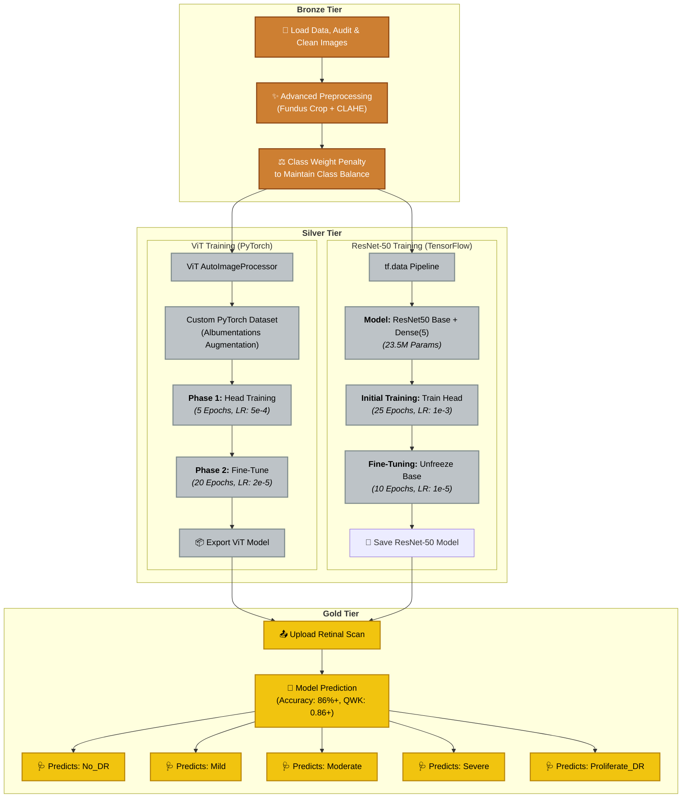

# 🩺 Diabetic Retinopathy Classifier (ViT & ResNet)


This project trains and deploys deep learning models (ViT & ResNet-50) for APTOS Diabetic Retinopathy classification.  
The diagram below shows the full pipeline:




This project provides a web-based Gradio app to classify **Diabetic Retinopathy** severity using:
- **Vision Transformer (ViT, PyTorch)**  
- **ResNet-50 (TensorFlow/Keras)**  

The app lets you upload a fundus retinal scan and get predictions for 5 DR stages:
**No_DR, Mild, Moderate, Severe, Proliferative_DR**  
Outputs are mapped to the **APTOS clinical order** for consistency.

---

## 🚀 Demo

👉 Try the live app here:  
🔗 [Hugging Face Space]([YOUR-HF-SPACE-URL])

---

## 📂 Repository Structure

├── app.py                   # Gradio app: loads ViT + ResNet models
├── requirements.txt         # Dependencies
├── LICENSE                  # MIT License
└── README.md                # This file


⚠️ Note: The model weights (`.keras`, `.safetensors`) are **not stored in GitHub** because of file size limits.  
They are hosted on Hugging Face Hub instead (see below).

---

## 📦 Models

- **ViT model (final export)**:  
  Available inside the [Hugging Face Space files]([YOUR-HF-SPACE-URL]/tree/main/dr-vit-EXPORT-final)  
  Includes:
  - `config.json`  
  - `model.safetensors`  
  - `preprocessor_config.json`  
  - `classes.json`

- **ResNet-50 model** (`retinopathy_baseline_model.keras`):  
  Also too large for GitHub. You can upload to Hugging Face Hub or provide a Google Drive link.

---

## 🔧 Installation & Local Run

Clone this repo:
```bash
git clone https://github.com/Mouryan-J/Diabetic-Retinopathy-using-ViT-Resnet50.git
cd DiabeticRetinopathy-ViT-Resnet


## Install dependencies:

pip install -r requirements.txt

Training Notes
	•	ViT was fine-tuned in 2 phases (head-only + backbone unfreeze) with class-balanced loss.
	•	ResNet-50 was trained in Keras with a similar label remapping to match APTOS dataset order.
	•	Both models output predictions remapped into canonical order:
No_DR → Mild → Moderate → Severe → Proliferative_DR.

📜 License

This repo is licensed under the MIT License.
You are free to use, modify, and distribute it, but attribution is appreciated.


✨ Acknowledgements
	•	APTOS 2019 Blindness Detection Dataset
	•	Hugging Face Transformers
	•	Gradio
